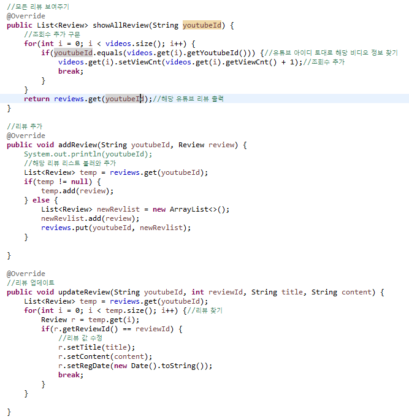

# 관통 프로젝트 3 후기

## 개요
- 이번 관통 프로젝트에서는 기존에 배웠던 BackEnd 지식을 바탕으로 SSAFIT 홈페이지를 구현해 보는 작업을 수행했습니다.

- 작성 정보
    - 작성자 : SSAFY 10기 서울 7반 김태운
    - 개발일시 : 2023-09-15 ~ 09-17
    - 개발언어 : Java, html, css
    - 개발도구 : Eclipse-EE(2018-09), Google Chrome
    - 그 외 사용 플랫폼 : github, discord, mattermost

## 전체 구조
- 프로젝트는 MVC 기반으로 설계되었으며, 세명이 각자 Model, View, Controller를 분담하여 설계했습니다.
- 프로그램이 실행되면 index.html이 실행되는데, 여기서 act=main을 담아 MainController.java로 보내주고, 이에 따라 main.jsp로 넘어가는 구조입니다.

- 모든 입력 결과는 controller에 해당하는 MainController에서 작업을 처리합니다. "act"라는 parameter의 값을 읽어 필요한 메서드를 실행시키도록 만들었습니다.
- 작업을 처리할 때는 model을 불러옵니다. MainDaoImpl.java 파일에 model이 구현되어 있습니다. singleton 기법을 사용하여 데이터 관리를 일원화 하였습니다.
- main.jsp에서 보고자 하는 영상을 클릭하면 해당 영상에 대한 review.jsp페이지로 넘어갑니다.

- 이 페이지에서 '리뷰 등록' 버튼을 누르면 리뷰 등록 모달이 열립니다. 리뷰 제목, 작성자, 리뷰 내용을 입력한 후 등록이 가능하게 만들었습니다.

- 리뷰를 등록하면 등록 결과가 즉시 보여집니다.

- 리뷰를 누르면 상세 보기가 가능하고 이 화면에서 리뷰 수정, 삭제가 가능합니다.

- 리뷰 수정 시에는 리뷰 제목, 내용 변경 가능하며 변경 후에는 시간도 자동으로 바뀝니다.

- 이상이 전반적인 사이트 구조입니다.

## 나의 파트 자세한 설명
- 저는 팀에서 MVC 중 M에 해당하는 Model 파트를 맡았습니다. 사이트의 기능과 직접적 연관이 있는 파트였습니다.
- 구현은 메인 페이지와 리뷰 등록 등 관련 부분까지였습니다. 아쉽게도 회원 가입은 시도했으나 데이터 상으로 입력은 되지만 실제 결과를 view로 만들어 되돌려 주는 것까지는 구현하지 못했습니다.

### 정의한 class
- 사이트의 각 기능별로 필요한 데이터가 다르기에 3가지 새로운 class를 선언하였습니다. 비디오 정보에 해당하는 Video, 리뷰 정보에 해당하는 Review, 회원 정보에 해당하는 Member이 그것입니다.

- Video class는 제목, 부위, 유튜브아이디, 채널명, 조회수를 필드로 가집니다.
- Review class는 영상의 유튜브아이디, 리뷰아이디, 제목, 작성자, 내용, 등록일, 조회수를 필드로 가지고 있으며 리뷰 숫자를 지정하기 위해 no라는 이름의 static 변수를 두고 있습니다.
- Member class는 이름, 아이디, 비밀번호를 필드로 가집니다.

### MainDaoImpl.java
- controller에 MainController가 있다면, model에는 MainDaoImpl이 있습니다. 이 파트에서 모델이 구현되고, 사이트의 기능을 하게 합니다.
- MainDaoImpl이 여럿 있을 경우 관리의 일원화가 되지 않아 문제가 생길 수 있기에 singleton기법을 적용했습니다.
- 이제 각 메서드들에 관해 설명드리겠습니다.

#### 생성자

- 데이터베이스 파트를 배우지 않았기에 초기 비디오 정보를 불러오기 위해서 생성자 내부에 비디오 객체를 만들어 videos라는 이름의 리스트에 넣는 작업을 진행했습니다. 이렇게 비디오 정보를 미리 입력해 넣었습니다.

#### 각각의 리스트들

- 비디오, 리뷰, 회원 정보를 관리하기 위해 비디오, 회원 정보는 ArrayList를 만들어 videos, members라는 이름으로 구현했고, 리뷰의 경우 <영상의 youtubeId, 해당 영상의 리뷰 ArrayList>라는 형식의 HashMap으로 구현해 각 영상별로 리뷰를 관리하도록 하였습니다.

#### 비디오와 관련된 methods

- video에 대한 method는 세 가지입니다.
    - `selectAllvideo()`
    - `selectInterestVieFitVideo()`
    - `selectPartFitVideo(String fitPartName)`
-  `selectAllvideo()`는 전체 비디오 리스트를 돌려주는 함수입니다.
- `selectInterestVieFitVideo()`는 비디오를 조회순으로 정렬하는 함수입니다. 비디오를 자세히 볼 때마다 조회수가 늘어나는데, 조회수별로 정렬하도록 만들어 main.jsp의 윗단에 해당하는 '최근 가장 많이 본 영상'란에 표시되는 영상이 변동되도록 만들었습니다. 이를 위해 Video class에 따로 comparator를 정의해 sorting을 가능하게 했습니다.
- `selectPartFitVideo(String fitPartName)`는 부위별 비디오 정보를 반환해줍니다. fitPartName을 인자로 받고, videos 리스트를 돌며 fitPartName이 일치하는 것을 answer list에 추가해 answer을 반환하는 방식입니다.

#### 리뷰와 관련된 methods

- reivew에 대한 method는 다섯 가지 입니다.
    - `showAllReview(String youtubeId)`
    - `addReview(String youtubeId, Review review)`
    - `updateReview(String youtubeId, int reviewId, String title, String content)`
    - `showDetailReview(String youtubeId, int reviewId)`
    - `deleteReview(String youtubeId, int reviewId)`
- `showAllReview(String youtubeId)`는 video와도 연관이 깊습니다. main.jsp에서 비디오를 누를 경우 넘어가는 다음 화면에서 해당 영상에 대한 상세 정보와 함께 해당 영상의 리뷰를 보여주는데, 이 때, 사용하는 함수입니다. List<Review>형태로 HashMap에서 해당 youtubeId를 key로 하는 리뷰를 반환합니다. 또, videos의 해당 비디오의 조회수도 1씩 올라가도록 만들었습니다.
- `addReview(String youtubeId, Review review)`는 해당 영상에 리뷰를 등록할 때 사용합니다. 리뷰가 한 번도 등록된 적이 없을 경우 새로운 ArrayList를 만들어 key로 youtubeId, value로 해당 리스트를 넣어 정보를 저장하고, 이미 있는 경우 기존 리스트를 불러와 거기 추가만 해줍니다.
- `updateReview(String youtubeId, int reviewId, String title, String content)`는 리뷰 수정에 사용됩니다. youtubeId, reviewId, title, content를 인자로 받습니다. HashMap에서 yotubeId를 이용해 리스트를 불러오고, 리스트에서 reviewId를 통해 해당 Review 인스턴스를 찾은 후, title, content를 새로 입력한 값으로, regDate를 새롭게 갱신해 줍니다.
- `showDetailReview(String youtubeId, int reviewId)`는 존재하는 리뷰를 눌렀을 때 보여지는 창을 위해 존재하며, youtubeId, reviewId를 인자로 갖습니다. youtubeId로 해당 List<Review>를 불러오고, reviewId를 통해 해당 Review 인스턴스를 찾아 반환합니다.
- `deleteReview(String youtubeId, int reviewId)`는 리뷰 삭제에 사용됩니다. 메커니즘은 위의 showDetailReview와 비슷하나 이번에는 해당 인스턴스를 찾으면 지우는 함수를 수행하는게 차이점입니다.

#### 회원 관련 메서드
- 이 기능의 경우 view에 반영 안되어 있으나 우선 구현을 시도해 보았기에 적어봅니다.

- 메서드는 2가지입니다.
    - `signUp(Member member)`
    - `signIn(String id, String password)`
- `signUp(Member member)`는 회원가입 함수로 Member객체로 들어온 값을 members리스트에 추가해 줍니다.
- `signIn(String id, String password)`은 로그인 함수로 id, password를 인자로 받아 members내에 일치하는 값이 있으면 true를, 아니면 false를 반환해줍니다.

## 전반적 소감.
- 지금까지 관통 프로젝트를 몇 번 수행해 보았지만, 팀원들과 체계적으로 파트를 만들어 열심히 개발한 것은 이번이 제일 좋았던 것 같습니다.
- 각 팀원별 업무 분담, 소통 등이 매우 활발했고, github을 이용한 merge와 conflict 등의 문제 등 많은 것에 부딪혔지만 잘 해결했습니다.
- 서로의 코드를 보며 원인을 분석하고 문제를 해결하며 소통의 중요성을 실감했고, 내 담당이 아니어도 다른 사람의 코드를 읽고 전체적인 흐름을 분석할 줄 아는 능력이 정말 중요하다는 것을 실감했습니다.
- 앞으로 추가로 있을 프로젝트들에서도 이러한 경험들을 바탕으로 더욱 좋은 결과를 낼 수 있도록 노력하겠습니다.