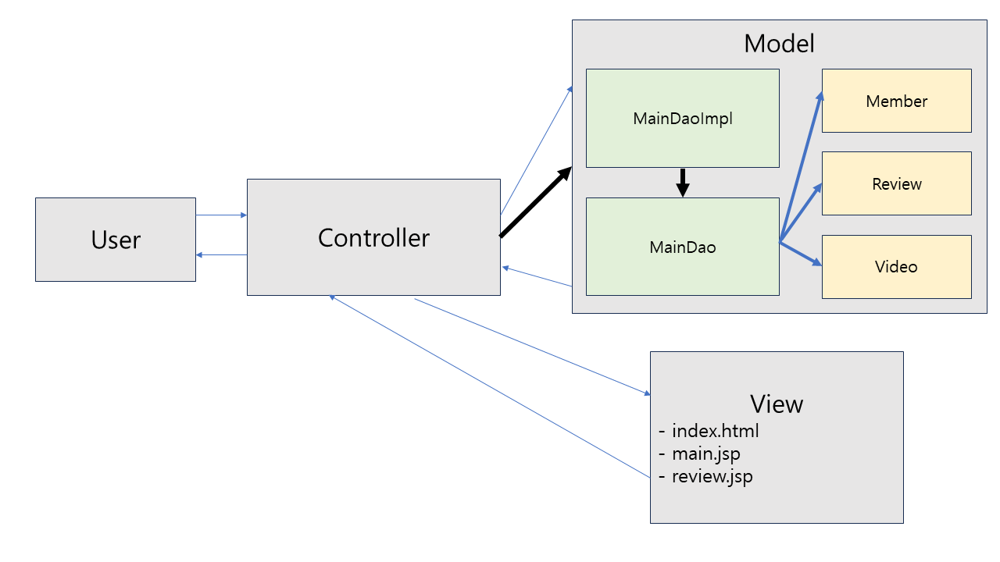
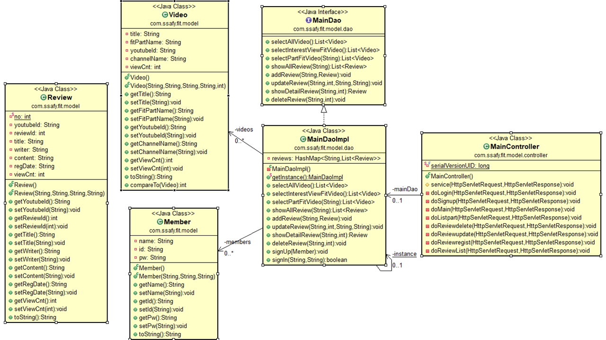
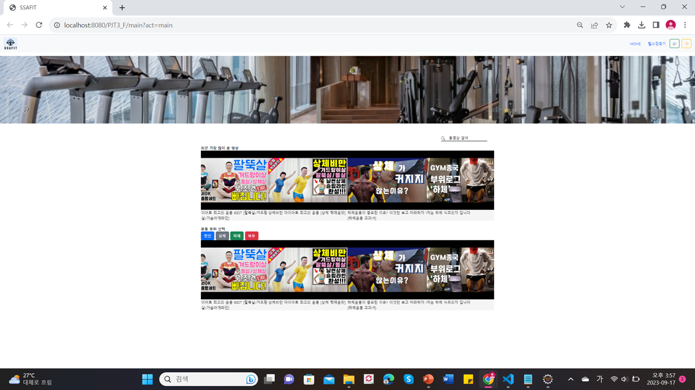
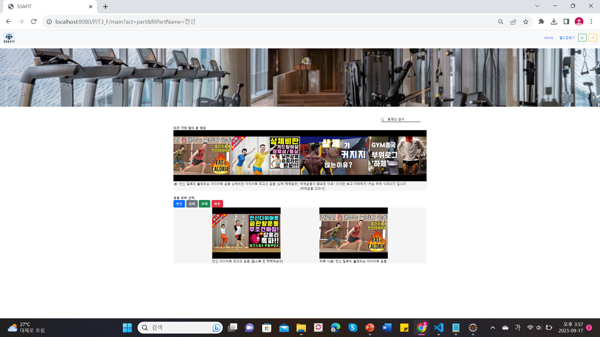
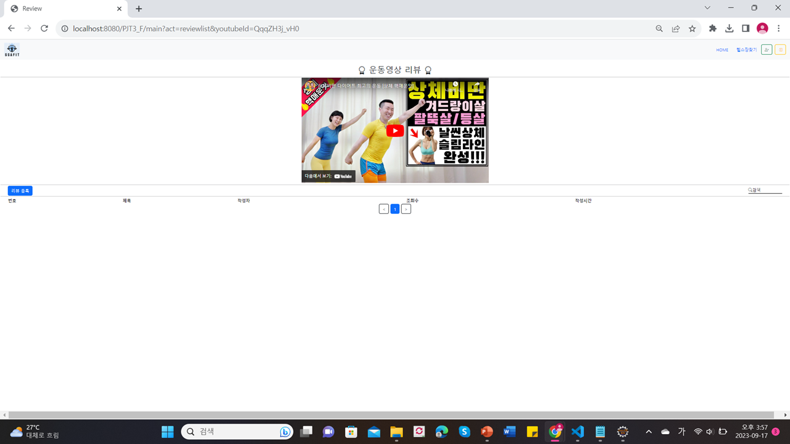
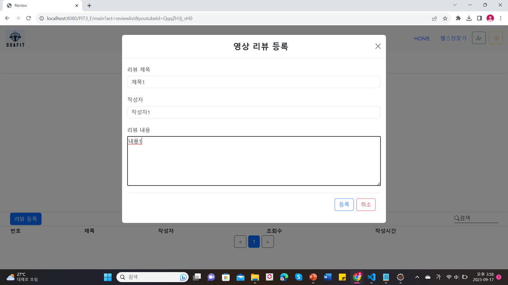
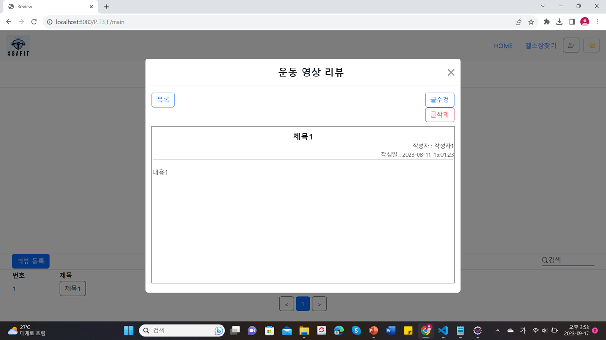
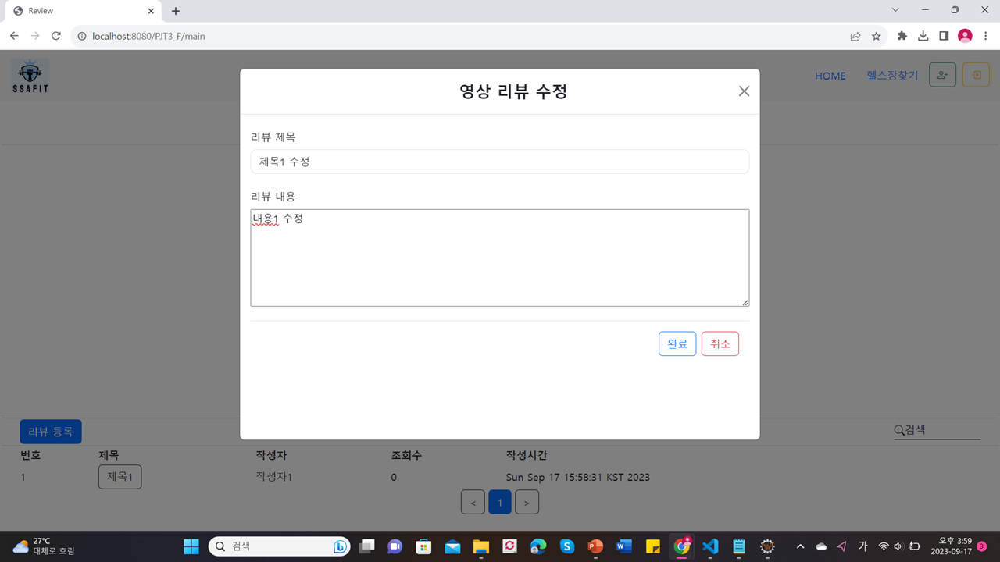

## PJT 03 WebBackEnd

### 1. 작성 정보
- 작성자: 서울 7반 유현정
- 날짜: 2023-09-15~2023-09-17
- 개발도구: Eclipse-ee, Google Chrome
- 사용언어: 자바
- 소통 플랫폼: Git hub, discord, MatterMost


### 2. 프로젝트 목표
- Java의 BackeEnd 기술인 Servlet/JSP를 이해하고, 이를 활용하여 웹 서버를 구축한다.
- MVC 구조를 이해하고, 이를 활용하여 프로그램을 작성한다.
- FrontEnd 관통 프로젝트를 참고하여 화면과 연계가 필요한 부분의 BackEnd를 완성한다.


### 3. 프로젝트 요구사항
- 메인페이지✔
    - 조회수별 정렬
    - 운동부위별 정렬
- 리뷰 관리✔
    - 리뷰 정렬
    - 리뷰 등록
    - 리뷰 수정
    - 리뷰 삭제
- 만든 백엔드 기능을 PJT 02에서 구현한 프론트엔드와 연결한다.✔
- 추가
    - 회원가입
    - 로그인
    - 로그아웃
- 심화
    - 회원 팔로우
    - 영상 찜하기


### 4. MVC 구상



### 5. 클래스 다이어그램



### 6. 코드
- SRC
    - Member.java
     ```
            package com.ssafy.fit.model;
            //회원 정보를 위한 class
            public class Member {
            //회원 이름, 아이디, 비밀번호
            private String name;
            private String id;
            private String pw;
        
            public Member() {}

            public Member(String name, String id, String pw) {
                super();
                this.name = name;
                this.id = id;
                this.pw = pw;
            }

            public String getName() {
                return name;
            }

            public void setName(String name) {
                this.name = name;
            }

            public String getId() {
                return id;
            }

            public void setId(String id) {
                this.id = id;
            }

            public String getPw() {
                return pw;
            }

            public void setPw(String pw) {
                this.pw = pw;
            }

            @Override
            public String toString() {
                return "Member [name=" + name + ", id=" + id + ", pw=" + pw + "]";
            }
            } 
    ```
    - Review.java
        ```
            package com.ssafy.fit.model;

            import java.util.Date;

            public class Review {
                private static int no = 1;
                
                private String youtubeId;
                private int reviewId;
                private String title;
                private String writer;
                private String content;
                private String regDate;
                private int viewCnt;
                
                public Review() {
                    
                }

                public Review(String youtubeId, String title, String writer, String content) {
                    super();
                    this.youtubeId = youtubeId;
                    this.reviewId = no++;
                    this.title = title;
                    this.writer = writer;
                    this.content = content;
                    this.regDate = new Date().toString();
                    this.viewCnt = 0;
                }


                public String getYoutubeId() {
                    return youtubeId;
                }

                public void setYoutubeId(String youtubeId) {
                    this.youtubeId = youtubeId;
                }

                public int getReviewId() {
                    return reviewId;
                }

                public void setReviewId(int reviewId) {
                    this.reviewId = reviewId;
                }

                public String getTitle() {
                    return title;
                }

                public void setTitle(String title) {
                    this.title = title;
                }

                public String getWriter() {
                    return writer;
                }

                public void setWriter(String writer) {
                    this.writer = writer;
                }

                public String getContent() {
                    return content;
                }

                public void setContent(String content) {
                    this.content = content;
                }

                public String getRegDate() {
                    return regDate;
                }

                public void setRegDate(String regDate) {
                    this.regDate = regDate;
                }

                public int getViewCnt() {
                    return viewCnt;
                }

                public void setViewCnt(int viewCnt) {
                    this.viewCnt = viewCnt;
                }

                @Override
                public String toString() {
                    return "Review [youtubeId=" + youtubeId + ", reviewId=" + reviewId + ", title=" + title + ", writer=" + writer
                            + ", content=" + content + ", regDate=" + regDate + ", viewCnt=" + viewCnt + "]";
                }
            }
        ```

    - Video. java
        ```
            package com.ssafy.fit.model;

            public class Video implements Comparable<Video>{
                private String title;
                private String fitPartName;
                private String youtubeId;
                private String channelName;
                private int viewCnt;
                public Video() {}
                
                public Video(String title, String fitPartName, String youtubeId, String channelName, int viewCnt) {
                    super();
                    this.title = title;
                    this.fitPartName = fitPartName;
                    this.youtubeId = youtubeId;
                    this.channelName = channelName;
                    this.viewCnt = viewCnt;
                }

                public String getTitle() {
                    return title;
                }

                public void setTitle(String title) {
                    this.title = title;
                }

                public String getFitPartName() {
                    return fitPartName;
                }

                public void setFitPartName(String fitPartName) {
                    this.fitPartName = fitPartName;
                }

                public String getYoutubeId() {
                    return youtubeId;
                }

                public void setYoutubeId(String youtubeId) {
                    this.youtubeId = youtubeId;
                }

                public String getChannelName() {
                    return channelName;
                }

                public void setChannelName(String channelName) {
                    this.channelName = channelName;
                }

                public int getViewCnt() {
                    return viewCnt;
                }

                public void setViewCnt(int viewCnt) {
                    this.viewCnt = viewCnt;
                }

                @Override
                public String toString() {
                    return "Video [title=" + title + ", fitPartName=" + fitPartName + ", youtubeId=" + youtubeId + ", channelName="
                            + channelName + ", viewCnt=" + viewCnt + "]";
                }

                @Override
                public int compareTo(Video o) {
                    
                    return o.viewCnt - this.viewCnt;
                }
                
            }
        ```
    - MainDao.java
        ```
            package com.ssafy.fit.model.dao;

            import java.util.List;

            import com.ssafy.fit.model.Member;
            import com.ssafy.fit.model.Review;
            import com.ssafy.fit.model.Video;

            public interface MainDao {
                List<Video> selectAllVideo();
                List<Video> selectInterestViewFitVideo();
                List<Video> selectPartFitVideo(String fitPartName);
                
                List<Review> showAllReview(String youtubeId);
                void addReview(String youtubeId, Review review);
                void updateReview(String youtubeId, int reviewId, String title, String content);
                Review showDetailReview(String youtubeId, int reviewId);
                void deleteReview(String youtubeId, int reviewId);
                
                void signUp(Member member);
                boolean signIn(String id, String password);
            }
        ```
    - MainDaoImpl.java
        ```
            package com.ssafy.fit.model.dao;

            import java.util.ArrayList;
            import java.util.Collections;
            import java.util.Date;
            import java.util.HashMap;
            import java.util.List;

            import com.ssafy.fit.model.Member;
            import com.ssafy.fit.model.Review;
            import com.ssafy.fit.model.Video;

            public class MainDaoImpl implements MainDao{
                //data
                private List<Video> videos = new ArrayList<>();
                private HashMap<String, List<Review>> reviews = new HashMap<>();
                private List<Member> members = new ArrayList<>();
                
                
                //singleton
                private static MainDaoImpl instance = new MainDaoImpl();
                
                private MainDaoImpl() {
                    videos.add(new Video("전신 다이어트 최고의 운동 [칼소폭 찐 핵핵매운맛]","전신","gMaB-fG4u4g","ThankyouBUBU",0));
                    videos.add(new Video("하루 15분! 전신 칼로리 불태우는 다이어트 운동","전신","swRNeYw1JkY","ThankyouBUBU",0));
                    videos.add(new Video("상체 다이어트 최고의 운동 BEST [팔뚝살/겨드랑이살/등살/가슴어깨라인]","상체","54tTYO-vU2E","ThankyouBUBU",0));
                    videos.add(new Video("상체비만 다이어트 최고의 운동 [상체 핵매운맛]","상체","QqqZH3j_vH0","ThankyouBUBU",0));
                    videos.add(new Video("하체운동이 중요한 이유? 이것만 보고 따라하자 ! [하체운동 교과서]","하체","tzN6ypk6Sps","김강민",0));
                    videos.add(new Video("저는 하체 식주의자 입니다","하체","u5OgcZdNbMo","GYM종국",0));
                    videos.add(new Video("11자복근 복부 최고의 운동 [복근 핵매운맛]","복부","PjGcOP-TQPE","ThankyouBUBU",0));
                    videos.add(new Video("(Sub)누워서하는 5분 복부운동!! 효과보장! (매일 2주만 해보세요!)","복부","7TLk7pscICk","SomiFit",0));
                };
                
                public static MainDaoImpl getInstance() {
                    return instance;
                }
                
                //모든 비디오 리스트
                public List<Video> selectAllVideo(){
                    return videos;
                }
                
                //조회수에 따른 비디오 정렬
                @Override
                public List<Video> selectInterestViewFitVideo() {
                    //비디오를 정렬할 배열 생성
                    List<Video> answer = new ArrayList<>();
                    for(int i = 0; i < videos.size(); i++) {
                        answer.add(videos.get(i));
                    }
                    //정렬
                    Collections.sort(answer);
                    
                    return answer;
                }

                //비디오 부위별 출력
                @Override
                public List<Video> selectPartFitVideo(String fitPartName) {
                    List<Video> answer = new ArrayList<>();
                    
                    for(int i = 0; i < videos.size(); i++) {//부위가 일치하는 비디오 찾아 추가
                        if(fitPartName.equals(videos.get(i).getFitPartName())) {
                            answer.add(videos.get(i));
                        }
                    }
                    
                    return answer;
                }

                //모든 리뷰 보여주기
                @Override
                public List<Review> showAllReview(String youtubeId) {
                    //조회수 추가 구문
                    for(int i = 0; i < videos.size(); i++) {
                        if(youtubeId.equals(videos.get(i).getYoutubeId())) {//유튜브 아이디 토대로 해당 비디오 정보 찾기
                            videos.get(i).setViewCnt(videos.get(i).getViewCnt() + 1);//조회수 추가
                            break;
                        }
                    }
                    return reviews.get(youtubeId);//해당 유튜브 리뷰 출력
                }

                //리뷰 추가
                @Override
                public void addReview(String youtubeId, Review review) {
            //		System.out.println(youtubeId);
                    //해당 리뷰 리스트 불러와 추가
                    List<Review> temp = reviews.get(youtubeId);
                    if(temp != null) {
                        temp.add(review);
                    } else {
                        List<Review> newRevlist = new ArrayList<>();
                        newRevlist.add(review);
                        reviews.put(youtubeId, newRevlist);
                    }
                    
                }

                @Override
                //리뷰 업데이트
                public void updateReview(String youtubeId, int reviewId, String title, String content) {
                    List<Review> temp = reviews.get(youtubeId);
                    for(int i = 0; i < temp.size(); i++) {//리뷰 찾기
                        Review r = temp.get(i);
                        if(r.getReviewId() == reviewId) {
                            //리뷰 값 수정
                            r.setTitle(title);
                            r.setContent(content);
                            r.setRegDate(new Date().toString());
                            break;
                        }
                    }
                    
                }

                @Override
                //리뷰 자세히(처음 리뷰 볼 때만)
                public Review showDetailReview(String youtubeId, int reviewId) {
                    List<Review> temp = reviews.get(youtubeId);
                    //해당 리뷰 찾아 반환
                    for(int i = 0; i < temp.size(); i++) {
                        Review r = temp.get(i);
                        if(r.getReviewId() == reviewId) {
                            r.setViewCnt(r.getViewCnt() + 1);
                            return r;
                        }
                    }
                    return null;
                }

                @Override
                //리뷰 삭제
                public void deleteReview(String youtubeId, int reviewId) {
                    List<Review> temp = reviews.get(youtubeId);
                    //해당 리뷰 찾아 삭제
                    for(int i = 0; i < temp.size(); i++) {
                        Review r = temp.get(i);
                        if(r.getReviewId() == reviewId) {
                            temp.remove(i);
                            break;
                        }
                    }
                }
                
                
                //회원 가입
                public void signUp(Member member) {
                    //멤버 리스트에 추가
                    members.add(member);
                    
                    //정보 전달 확인 테스트용
            //		System.out.println(member);
                }
                
                //로그인
                public boolean signIn(String id, String password) {
                    //반환값 valid
                    boolean valid = false;
                    for(int i = 0; i < members.size(); i++) {//members 리스트에서 id, password 일치 시 valid를 true로 변환
                        Member m = members.get(i);
                        if(m.getId().equals(id) && m.getPw().equals(password)) {
                            valid = true;
                            break;
                        }
                    }
                    //반환
                    return valid;
                }
            }
        ```
    - MainController.java
        ```
            package com.ssafy.fit.model.controller;

            import java.io.IOException;
            import java.util.List;

            import javax.servlet.ServletException;
            import javax.servlet.annotation.WebServlet;
            import javax.servlet.http.HttpServlet;
            import javax.servlet.http.HttpServletRequest;
            import javax.servlet.http.HttpServletResponse;

            import com.ssafy.fit.model.Member;
            import com.ssafy.fit.model.Review;
            import com.ssafy.fit.model.dao.MainDaoImpl;

            @WebServlet("/main")
            public class MainController extends HttpServlet{
                
                /**
                * 
                */
                private static final long serialVersionUID = 1L;

                //의존성 주입
            //	private MainDao mainDao = MainDaoImpl.getInstance();
                private MainDaoImpl mainDao = MainDaoImpl.getInstance();
                
                protected void service(HttpServletRequest req, HttpServletResponse res) throws ServletException, IOException {
                    if(req.getMethod().equals("POST")) {
                        req.setCharacterEncoding("UTF-8");
                    }
                    
                    
                    String act = req.getParameter("act");
                    
                    switch(act) {
                    case"main":
                        doMain(req, res);
                        break;
                        
                    case "part"://
                        doListpart(req, res);
                        break;
                        
                    case "reviewlist":
                        doReviewList(req, res);
                        break;
                        
                    case "reviewregist":
                        doReviewregist(req, res);
                        break;
                        
                    case "reviewupdate":
                        doReviewupdate(req, res);
                        break;
                        
            //		case "reviewdetail":
            //			doReviewdetail(req, res);
            //			break;
                        
                    case "reviewdelete":
                        doReviewdelete(req, res);
                        break;
                        
                    case "signup":
                        doSignup(req, res);
                        break;
                        
                    case "login":
                        doLogin(req, res);
                        break;
                        
                    default:
                        break;
                    }
                  
                }

                //로그인
                private void doLogin(HttpServletRequest req, HttpServletResponse res) throws ServletException, IOException {
                    mainDao.signIn(req.getParameter("membername"), req.getParameter("memberpw"));
                    req.setAttribute("watchvideos", mainDao.selectInterestViewFitVideo());
                    req.setAttribute("partvideos", mainDao.selectAllVideo());
                    doMain(req,res);
                }

                //회원가입
                private void doSignup(HttpServletRequest req, HttpServletResponse res) throws ServletException, IOException {
                    String name = req.getParameter("name");
                    String id = req.getParameter("id");
                    String pw = req.getParameter("pw");
                    
                    Member member = new Member();
                    
                    member.setName(name);
                    member.setId(id);
                    member.setPw(pw);

                    mainDao.signUp(member);
                    req.setAttribute("watchvideos", mainDao.selectInterestViewFitVideo());
                    req.setAttribute("partvideos", mainDao.selectAllVideo());
                    doMain(req,res);
            //		res.sendRedirect("/PJT3_F/main.jsp");
                }

                //메인페이지화면-동영상 정보 가져오기&조회수에 따른 비디오 오름차순 정렬
                private void doMain(HttpServletRequest req, HttpServletResponse res) throws ServletException, IOException {
                    req.setAttribute("watchvideos", mainDao.selectInterestViewFitVideo());
                    req.setAttribute("partvideos", mainDao.selectAllVideo());
                    req.setAttribute("videos", mainDao.selectAllVideo());
                    req.getRequestDispatcher("/main.jsp").forward(req, res);
                    
                }

                //파트별 비디오 정렬
                private void doListpart(HttpServletRequest req, HttpServletResponse res) throws ServletException, IOException {
                    req.setAttribute("watchvideos", mainDao.selectInterestViewFitVideo());
                    req.setAttribute("partvideos", mainDao.selectPartFitVideo(req.getParameter("fitPartName")));
                    req.getRequestDispatcher("/main.jsp").forward(req, res);
                }

                //리뷰 삭제
                private void doReviewdelete(HttpServletRequest req, HttpServletResponse res) throws IOException, ServletException {	
                    mainDao.deleteReview(req.getParameter("youtubeId"), Integer.parseInt(req.getParameter("reviewId")));
                    doReviewList(req,res);
            //		req.getRequestDispatcher("/review.jsp").forward(req, res);
                }

                //리뷰 상세보기
            //	private void doReviewdetail(HttpServletRequest req, HttpServletResponse res) {
            //		
            //		
            //	}

                //리뷰수정
                private void doReviewupdate(HttpServletRequest req, HttpServletResponse res) throws IOException, ServletException {
                    String youtubeId = req.getParameter("youtubeId");
                    int reviewId = Integer.parseInt(req.getParameter("reviewId"));
                    String title = req.getParameter("title");
                    String content = req.getParameter("content");
            //		Review temp = mainDao.getReview(req.getParameter("youtubeId"), Integer.parseInt(req.getParameter("reviewId")));
                    mainDao.updateReview(youtubeId, reviewId, title, content );
                    
                    doReviewList(req,res);
            //		req.getRequestDispatcher("/review.jsp").forward(req, res);
                    
                }

                //리뷰등록
                private void doReviewregist(HttpServletRequest req, HttpServletResponse res) throws IOException, ServletException {
                    String youtubeId = req.getParameter("youtubeId");
                    String title = req.getParameter("title");
                    String writer = req.getParameter("writer");
                    String content = req.getParameter("content");
                    
                    Review temp = new Review(youtubeId, title, writer, content);
                    
                    mainDao.addReview(req.getParameter("youtubeId"), temp);
                    
                    req.setAttribute("reviews", (List<Review>)mainDao.showAllReview(req.getParameter("youtubeId")));
            //		Review temp = mainDao.getReview(req.getParameter("youtubeId"), Integer.parseInt(req.getParameter("reviewId")));
                    doReviewList(req,res);
            //		req.getRequestDispatcher("/review.jsp").forward(req, res);
                }
                
                //리뷰 리스트 보여주기
                private void doReviewList(HttpServletRequest req, HttpServletResponse res) throws IOException, ServletException {
                    mainDao.showAllReview(req.getParameter("youtubeId"));
                    req.setAttribute("youtubeId", req.getParameter("youtubeId"));
                    req.setAttribute("reviews", mainDao.showAllReview(req.getParameter("youtubeId")));
            //		res.sendRedirect("/PJT3_F/review.jsp");
                    req.getRequestDispatcher("/review.jsp").forward(req, res);
                }
            }
        ```

- WebContent
    - index.html
        ```
            <!DOCTYPE html>
            <html>
            <head>
            <meta charset="EUC-KR">
            <title>Insert title here</title>
            </head>
            <body>
                <script type ="text/javascript">
                    location.href = "main?act=main"
                </script>

            </body>
            </html>
        ```
    - main.jsp
        ```
            <%@ page language="java" contentType="text/html; charset=UTF-8" pageEncoding="UTF-8"%>
            <%@ taglib uri="http://java.sun.com/jsp/jstl/core" prefix="c"%>
            <%@ page import="com.ssafy.fit.model.Review"%>
            <%@ page import="com.ssafy.fit.model.Video"%>
            <!DOCTYPE html>
            <html lang="ko">
            <head>
            <meta charset="UTF-8" />
            <meta name="viewport" content="width=device-width, initial-scale=1.0" />
            <title>SSAFIT</title>
            <link rel="stylesheet" href="css/app.css">
            <link
                href="https://cdn.jsdelivr.net/npm/bootstrap@5.3.1/dist/css/bootstrap.min.css"
                rel="stylesheet"
                integrity="sha384-4bw+/aepP/YC94hEpVNVgiZdgIC5+VKNBQNGCHeKRQN+PtmoHDEXuppvnDJzQIu9"
                crossorigin="anonymous" />
            <link rel="stylesheet"
                href="https://cdn.jsdelivr.net/npm/bootstrap-icons@1.8.0/font/bootstrap-icons.css" />
            </head>
            <body>
                <header>
                    <nav id="navbar-example2" class="navbar bg-body-tertiary px-3 mb-3">
                        <a class="navbar-brand" href="index.html"> 
                        </a>
                        <ul class="nav nav-pills">
                            <li class="nav-item"><a class="nav-link" href="main.jsp">HOME</a>
                            </li>
                            <li class="nav-item"><a class="nav-link" href="search.html">헬스장찾기</a>
                            </li>
                            <li class="nav-item">
                                <button type="button" class="btn btn-outline-success fa-2x"
                                    style="margin-right: 10px" data-bs-toggle="modal"
                                    data-bs-target="#Register" data-bs-whatever="@getbootstrap">
                                    <i class="bi bi-person-plus"></i>
                                </button>
                            </li>
                            <li class="nav-item">
                                <button type="button" class="btn btn-outline-warning fa-2x"
                                    data-bs-toggle="modal" data-bs-target="#login"
                                    data-bs-whatever="@getbootstrap">
                                    <i class="bi bi-box-arrow-in-right"></i>
                                </button></
                            </li>


                            </li>
                        </ul>
                    </nav>

                    


                </header>

                <main> <br>
                <br>
                <div class="container">
                    <div class="search">
                        <svg xmlns="http://www.w3.org/2000/svg" width="16" height="16"
                            fill="currentColor" class="bi bi-search" viewBox="0 0 16 16">
                        <path
                                d="M11.742 10.344a6.5 6.5 0 1 0-1.397 1.398h-.001c.03.04.062.078.098.115l3.85 3.85a1 1 0 0 0 1.415-1.414l-3.85-3.85a1.007 1.007 0 0 0-.115-.1zM12 6.5a5.5 5.5 0 1 1-11 0 5.5 5.5 0 0 1 11 0z" />
                    </svg>
                        &nbsp; 동영상 검색
                        &nbsp;&nbsp;&nbsp;&nbsp;&nbsp;&nbsp;&nbsp;&nbsp;&nbsp;&nbsp;&nbsp;&nbsp;&nbsp;&nbsp;
                    </div>
                </div>
                <br>
                <br>

                <div class="container">
                    <b> 최근 가장 많이 본 영상</b>
                    <div id="carouselExample" class="carousel slide">
                        <div class="carousel-inner">
                            <div class="carousel-item active">
                                <div class="container video-View">
                                    <c:forEach var="video" items="${watchvideos }">
                                        <div>
                                            <a href="main?act=reviewlist&youtubeId=${video.getYoutubeId() }"></a> ${video.getTitle() }
                                        </div>
                                    </c:forEach>
                                </div>
                            </div>
                        </div>
                        <button class="carousel-control-prev" type="button"
                            data-bs-target="#carouselExample" data-bs-slide="prev">
                            <span class="carousel-control-prev-icon" aria-hidden="true"></span>
                            <span class="visually-hidden">Previous</span>
                        </button>
                        <button class="carousel-control-next" type="button"
                            data-bs-target="#carouselExample" data-bs-slide="next">
                            </svg>
                            <span class="carousel-control-next-icon" aria-hidden="true"></span>
                            <span class="visually-hidden">Next</span>
                        </button>
                    </div>
                </div>

                <br>
                <div class="container">
                    <b> 운동 부위 선택</b>
                    <div>

                        <form method="GET" action="main">
                            <input type="hidden" name="act" value="part"> <input
                                type="hidden" name="fitPartName" value="전신">
                            <button type="submit" class="btn btn-primary">전신</button>
                        </form>
                        <form method="GET" action="main">
                            <input type="hidden" name="act" value="part"> <input
                                type="hidden" name="fitPartName" value="상체">
                            <button type="submit" class="btn btn-secondary">상체</button>
                        </form>
                        <form method="GET" action="main">
                            <input type="hidden" name="act" value="part"> <input
                                type="hidden" name="fitPartName" value="하체">
                            <button type="submit" class="btn btn-success">하체</button>
                        </form>
                        <form method="GET" action="main">
                            <input type="hidden" name="act" value="part"> <input
                                type="hidden" name="fitPartName" value="복부">
                            <button type="submit" class="btn btn-danger">복부</button>
                        </form>
                    </div>
                </div>
                <div class="container">
                    <div id="carouselExample1" class="carousel slide">
                        <div class="carousel-inner">
                            <div class="carousel-item active">
                                <div class="container video-View">
                                    <c:forEach var="video" items="${partvideos}">
                                        <div>
                                            <a href="main?act=reviewlist&youtubeId=${video.getYoutubeId()}">
                                            </a> ${video.getTitle() }
                                        </div>
                                    </c:forEach>
                                </div>
                            </div>
                            <button class="carousel-control-prev" type="button"
                                data-bs-target="#carouselExample1" data-bs-slide="prev">
                                <span class="carousel-control-prev-icon" aria-hidden="true"></span>
                                <span class="visually-hidden">Previous</span>
                            </button>
                            <button class="carousel-control-next" type="button"
                                data-bs-target="#carouselExample1" data-bs-slide="next">
                                </svg>
                                <span class="carousel-control-next-icon" aria-hidden="true"></span>
                                <span class="visually-hidden">Next</span>
                            </button>
                        </div>
                    </div>

                    <!-- 회원가입 -->
                    <div class="modal fade" id="Register" tabindex="-1"
                        aria-labelledby="exampleModalLabel" aria-hidden="true">
                        <div class="modal-dialog modal-s">
                            <div class="modal-content">
                                <div class="modal-header">
                                    <div class="modal-header-title">
                                        <h1 class="modal-title">회원 가입</h1>
                                    </div>
                                    <button type="button" class="btn-close" data-bs-dismiss="modal"
                                        aria-label="Close" style="margin-left: 10px !important"></button>
                                </div>
                                <div class="modal-body">
                                    <form method="POST" action="main">
                                        <input type="hidden" name="act" value="signup" />
                                        <div class="mb-3">
                                            <label for="recipient-name" class="col-form-label">이름</label> <input
                                                type="text" class="form-control" id="recipient-name"
                                                name="name">
                                        </div>
                                        <div class="mb-3">
                                            <label for="recipient-name" class="col-form-label">아이디</label> <input
                                                type="text" class="form-control" id="recipient-name" name="id">
                                        </div>
                                        <div class="mb-3">
                                            <label for="recipient-name" class="col-form-label">비밀번호</label>
                                            <input type="password" class="form-control" id="recipient-name"
                                                name="pw">
                                        </div>

                                        <div class="modal-footer">
                                            <button type="submit" class="btn btn-outline-primary"
                                                data-bs-dismiss="modal">가입하기</button>
                                            <button type="reset" class="btn btn-outline-danger"
                                                data-bs-dismiss="modal">취소</button>
                                    </form>
                                </div>
                            </div>
                        </div>
                    </div>
                </div>


                <!-- 로그인 -->
                <div class="modal fade" id="login" tabindex="-1"
                    aria-labelledby="exampleModalLabel" aria-hidden="true">
                    <div class="modal-dialog modal-s">
                        <div class="modal-content">
                            <div class="modal-header">
                                <div class="modal-header-title">
                                    <h1 class="modal-title">로그인</h1>
                                </div>
                                <button type="button" class="btn-close" data-bs-dismiss="modal"
                                    aria-label="Close" style="margin-left: 10px !important"></button>
                            </div>
                            <div class="modal-body">
                                <form action="main" method="POST">
                                    <input type="hidden" name="act" value="login" />
                                    <div class="mb-3">
                                        <label for="recipient-name" class="col-form-label">아이디</label> <input
                                            type="text" class="form-control" id="recipient-name"
                                            name="membername">
                                    </div>
                                    <div class="mb-3">
                                        <label for="recipient-name" class="col-form-label">비밀번호</label> <input
                                            type="password" class="form-control" id="recipient-name"
                                            name="memberpw">
                                    </div>

                                    <div class="modal-footer">
                                        <button type="submit" class="btn btn-outline-primary"
                                            data-bs-dismiss="modal">로그인</button>
                                        <button type="reset" class="btn btn-outline-danger"
                                            data-bs-dismiss="modal">취소</button>
                                    </div>
                                </form>
                            </div>
                        </div>
                    </div>
                </div>
                </main>

                <footer></footer>

                <!-- 	<script src="/02_front/main.js"></script> -->
                <script
                    src="https://cdn.jsdelivr.net/npm/bootstrap@5.3.1/dist/js/bootstrap.bundle.min.js"
                    integrity="sha384-HwwvtgBNo3bZJJLYd8oVXjrBZt8cqVSpeBNS5n7C8IVInixGAoxmnlMuBnhbgrkm"
                    crossorigin="anonymous"></script>
                <!-- script는 바디의 맨 마지막에-->
            </body>
            </html>
            </html>
        ```
    - review.jsp
        ```
            <%@ page language="java" contentType="text/html; charset=UTF-8" pageEncoding="UTF-8"%>
            <%@ taglib uri="http://java.sun.com/jsp/jstl/core" prefix="c"%>
            <%@ page import="com.ssafy.fit.model.Review"%>
            <%@ page import="com.ssafy.fit.model.Video"%>
            <!DOCTYPE html>
            <html lang="en">
            <head>
            <meta charset="UTF-8" />
            <meta name="viewport" content="width=device-width, initial-scale=1.0" />
            <title>Review</title>
            <link
                href="https://cdn.jsdelivr.net/npm/bootstrap@5.3.1/dist/css/bootstrap.min.css"
                rel="stylesheet"
                integrity="sha384-4bw+/aepP/YC94hEpVNVgiZdgIC5+VKNBQNGCHeKRQN+PtmoHDEXuppvnDJzQIu9"
                crossorigin="anonymous" />
            <link rel="stylesheet"
                href="https://cdn.jsdelivr.net/npm/bootstrap-icons@1.8.0/font/bootstrap-icons.css" />
            <link rel="stylesheet" href="css/style.css" />
            </head>
            <body>
                <header>
                    <nav id="navbar-example2" class="navbar bg-body-tertiary px-3 mb-3">
                        <a class="navbar-brand" href="index.html"> 
                        </a>
                        <ul class="nav nav-pills">
                            <li class="nav-item"><a class="nav-link" href="index.html">HOME</a>
                            </li>
                            <li class="nav-item"><a class="nav-link" href="search.html">헬스장찾기</a>
                            </li>
                            <li class="nav-item">
                                <button type="button" class="btn btn-outline-success fa-2x"
                                    style="margin-right: 10px" data-bs-toggle="modal"
                                    data-bs-target="#Register" data-bs-whatever="@getbootstrap">
                                    <i class="bi bi-person-plus"></i>
                                </button>
                            </li>
                            <li class="nav-item">
                                <button type="button" class="btn btn-outline-warning fa-2x"
                                    data-bs-toggle="modal" data-bs-target="#login"
                                    data-bs-whatever="@getbootstrap">
                                    <i class="bi bi-box-arrow-in-right"></i>
                                </button></
                            </li>


                            </li>
                        </ul>
                    </nav>

                    <div class="container text-center fs-2">
                        <i class="bi bi-award"></i> 운동영상 리뷰 <i class="bi bi-award"></i>
                    </div>
                    <hr />
                </header>
                <main width="100%"> <!-- 리뷰 목록 보여주는곳 -->
                <div class="contianer text-center">
                    <iframe width="728" height="410"
                        src="https://www.youtube.com/embed/${requestScope.youtubeId}"
                        title="YouTube video player" frameborder="0"
                        allow="accelerometer; autoplay; clipboard-write; encrypted-media; gyroscope; picture-in-picture; web-share"
                        allowfullscreen></iframe>
                </div>
                <hr />
                <section class="section">
                    <span>
                        <button type="button" class="btn btn-primary btn3"
                            data-bs-toggle="modal" data-bs-target="#reviewResigterModal"
                            data-bs-whatever="@getbootstrap">리뷰 등록</button>
                    </span>
                    <div class="search">
                        <i class="bi bi-search"></i>검색
                        &nbsp;&nbsp;&nbsp;&nbsp;&nbsp;&nbsp;&nbsp;&nbsp;&nbsp;&nbsp;&nbsp;&nbsp;&nbsp;&nbsp;
                    </div>
                </section>
                <hr />
                <table width="100%">
                    <thead>
                        <tr>
                            <th>번호</th>
                            <th>제목</th>
                            <th>작성자</th>
                            <th>조회수</th>
                            <th>작성시간</th>
                        </tr>
                    </thead>
                    <tbody>
                        <!-- 더미 데이터 여기는 안지워짐 수정도 불가 -->

                        <c:forEach var="review" items="${reviews}">
                            <tr>
                                <td>${review.getReviewId() }</td>
                                <td><button type="button" class="btn btn-outline-dark"
                                        data-bs-toggle="modal"
                                        data-bs-target="#review-detail-${review.getReviewId()}">
                                        ${review.getTitle() }</button></td>
                                <td>${review.getWriter() }</td>
                                <td>${review.getViewCnt() }</td>
                                <td>${review.getRegDate() }</td>
                            </tr>
                        </c:forEach>

                    </tbody>
                </table>
                <!-- 운동 영상 리뷰 (리뷰 디테일)--> <c:forEach var="review" items="${reviews}">
                    <div class="modal fade" id="review-detail-${review.getReviewId() }"
                        data-bs-backdrop="static" data-bs-keyboard="false" tabindex="-1"
                        aria-labelledby="staticBackdropLabel" aria-hidden="true">
                        <div class="modal-dialog modal-lg modal-dialog-centered">
                            <div class="modal-content">
                                <div class="modal-header">
                                    <div class="modal-header-title">
                                        <h1 class="modal-title" id="reviewlist">운동 영상 리뷰</h1>
                                    </div>
                                    <button type="button" class="btn-close" data-bs-dismiss="modal"
                                        aria-label="Close" style="margin-left: 10px !important"></button>
                                </div>
                                <div class="modal-body" aria-label="Basic example">
                                    <div class="btn-list">
                                        <div class="review-list-btn">
                                            <button type="button" class="btn btn-outline-primary"
                                                data-bs-dismiss="modal">목록</button>
                                        </div>
                                        <div class="review-rm-btn">
                                            <button type="button" class="btn btn-outline-primary"
                                                data-bs-target="#reviewModifyModal-${review.getReviewId()}"
                                                data-bs-toggle="modal">글수정</button>
                                            <form method="POST" action="main">
                                                <input type="hidden" name="act" value="reviewdelete" /> <input
                                                    type="hidden" name="youtubeId"
                                                    value="${requestScope.youtubeId}" /> <input type="hidden"
                                                    name="reviewId" value="${review.getReviewId()}" />
                                                <button type="submit" class="btn btn-outline-danger"
                                                    data-bs-dismiss="modal">글삭제</button>
                                            </form>


                                        </div>
                                    </div>
                                    <div class="review-detail-box">
                                        <div class="review-title">${review.getTitle()}</div>
                                        <div class="review-info">
                                            <div>작성자 : ${review.getWriter() }</div>
                                            <div>작성일 : 2023-08-11 15:01:23</div>
                                        </div>
                                        <hr>
                                        <div class="review-content">${review.getContent()}</div>

                                    </div>
                                </div>
                                <div class="modal-footer"></div>

                            </div>
                        </div>
                    </div>
                </c:forEach> <!-- 리뷰 등록 -->
                <div class="modal fade" id="reviewResigterModal" tabindex="-1"
                    aria-labelledby="exampleModalLabel" aria-hidden="true">
                    <div class="modal-dialog modal-lg">
                        <div class="modal-content">
                            <div class="modal-header">
                                <div class="modal-header-title">
                                    <h1 class="modal-title" id="reviewlist">영상 리뷰 등록</h1>
                                </div>
                                <button type="button" class="btn-close" data-bs-dismiss="modal"
                                    aria-label="Close" style="margin-left: 10px !important"></button>
                            </div>
                            <div class="modal-body">
                                <form action="main" method="POST">
                                    <input type="hidden" name="act" value="reviewregist" />
                                    <!-- review regist를 위해 추가적으로 주어야하는지 확인 필요 -->
                                    <input type="hidden" name="youtubeId"
                                        value="${requestScope.youtubeId}" />
                                    <div class="mb-3">
                                        <label for="recipient-name" class="col-form-label">리뷰 제목</label>
                                        <input type="text" class="form-control" id="recipient-name"
                                            name="title" placeholder="제목을 입력해주세요." />
                                    </div>
                                    <div class="mb-3">
                                        <label for="recipient-name" class="col-form-label">작성자</label> <input
                                            type="text" class="form-control" id="recipient-name"
                                            name="writer" placeholder="제목을 입력해주세요." />
                                    </div>
                                    <div class="mb-3">
                                        <label for="message-text" class="col-form-label">리뷰 내용</label>
                                        <textarea class="form-control-content" id="message-text"
                                            name="content" placeholder="내용을 입력해주세요."></textarea>
                                    </div>

                                    <div class="modal-footer">

                                        <button type="submit" class="btn btn-outline-primary"
                                            data-bs-dismiss="modal">등록</button>

                                        <button type="reset" class="btn btn-outline-danger"
                                            data-bs-dismiss="modal">취소</button>
                                    </div>
                                </form>
                            </div>
                        </div>
                    </div>
                </div>
                <!-- 영상 리뷰 수정 --> <c:forEach var="review" items="${reviews}">
                    <div class="modal fade" id="reviewModifyModal-${review.getReviewId()}"
                        tabindex="-1" aria-labelledby="exampleModalLabel" aria-hidden="true">
                        <div class="modal-dialog modal-lg">
                            <div class="modal-content">
                                <div class="modal-header">
                                    <div class="modal-header-title">
                                        <h1 class="modal-title" id="reviewlist">영상 리뷰 수정</h1>
                                    </div>
                                    <button type="button" class="btn-close" data-bs-dismiss="modal"
                                        aria-label="Close" style="margin-left: 10px !important"></button>
                                </div>
                                <div class="modal-body">
                                    <form>
                                        <input type="hidden" name="act" value="reviewupdate" />
                                        <input type="hidden" name="youtubeId"
                                        value="${requestScope.youtubeId}" />
                                        <input type="hidden" name="reviewId"
                                        value="${review.getReviewId()}" />
                                        <div class="mb-3">
                                            <label for="recipient-name" class="col-form-label">리뷰 제목</label>
                                            <input type="text" class="form-control" id="recipient-name"
                                                name="title" placeholder="제목을 입력해주세요." />
                                        </div>
                                        <div class="mb-3">
                                            <label for="message-text" class="col-form-label">리뷰 내용</label>
                                            <textarea class="form-control-content" id="message-text"
                                                name="content" placeholder="내용을 입력해주세요."></textarea>
                                        </div>

                                        <div class="modal-footer">
                                            <button type="submit" class="btn btn-outline-primary"
                                                data-bs-dismiss="modal">완료</button>
                                            <button type="reset" class="btn btn-outline-danger"
                                                data-bs-dismiss="modal">취소</button>
                                        </div>
                                    </form>
                                </div>
                            </div>
                        </div>
                    </div>
                </c:forEach> <!-- 회원가입 -->
                <div class="modal fade" id="Register" tabindex="-1"
                    aria-labelledby="exampleModalLabel" aria-hidden="true">
                    <div class="modal-dialog modal-s">
                        <div class="modal-content">
                            <div class="modal-header">
                                <div class="modal-header-title">
                                    <h1 class="modal-title">회원 가입</h1>
                                </div>
                                <button type="button" class="btn-close" data-bs-dismiss="modal"
                                    aria-label="Close" style="margin-left: 10px !important"></button>
                            </div>
                            <div class="modal-body">
                                <form method="POST" action="main">
                                    <input type="hidden" name="act" value="signup" />
                                    <div class="mb-3">
                                        <label for="recipient-name" class="col-form-label">이름</label> <input
                                            type="text" class="form-control" id="recipient-name" name="name">
                                    </div>
                                    <div class="mb-3">
                                        <label for="recipient-name" class="col-form-label">아이디</label> <input
                                            type="text" class="form-control" id="recipient-name" name="id">
                                    </div>
                                    <div class="mb-3">
                                        <label for="recipient-name" class="col-form-label">비밀번호</label> <input
                                            type="password" class="form-control" id="recipient-name"
                                            name="pw">
                                    </div>
                                </form>
                            </div>
                            <div class="modal-footer">
                                <button type="button" class="btn btn-outline-primary"
                                    data-bs-dismiss="modal">가입하기</button>
                                <button type="button" class="btn btn-outline-danger"
                                    data-bs-dismiss="modal">취소</button>
                            </div>
                        </div>
                    </div>
                </div>


                <!-- 로그인 -->
                <div class="modal fade" id="login" tabindex="-1"
                    aria-labelledby="exampleModalLabel" aria-hidden="true">
                    <div class="modal-dialog modal-s">
                        <div class="modal-content">
                            <div class="modal-header">
                                <div class="modal-header-title">
                                    <h1 class="modal-title">로그인</h1>
                                </div>
                                <button type="button" class="btn-close" data-bs-dismiss="modal"
                                    aria-label="Close" style="margin-left: 10px !important"></button>
                            </div>
                            <div class="modal-body">
                                <form action="main" method="POST">
                                    <input type="hidden" name="act" value="login" />
                                    <div class="mb-3">
                                        <label for="recipient-name" class="col-form-label">아이디</label> <input
                                            type="text" class="form-control" id="recipient-name"
                                            name="membername">
                                    </div>
                                    <div class="mb-3">
                                        <label for="recipient-name" class="col-form-label">비밀번호</label> <input
                                            type="password" class="form-control" id="recipient-name"
                                            name="memberpw">
                                    </div>

                                    <div class="modal-footer">
                                        <button type="submit" class="btn btn-outline-primary"
                                            data-bs-dismiss="modal">로그인</button>
                                        <button type="reset" class="btn btn-outline-danger"
                                            data-bs-dismiss="modal">취소</button>
                                    </div>
                                </form>
                            </div>
                        </div>
                    </div>
                </div>
                </main>
                <footer class="container text-center">
                    <button type="button" class="btn btn-outline-dark">&lt;</button>
                    <button type="button" class="btn btn-primary">1</button>
                    <button type="button" class="btn btn-outline-dark">&gt;</button>
                </footer>
                <script
                    src="https://cdn.jsdelivr.net/npm/bootstrap@5.3.1/dist/js/bootstrap.bundle.min.js"
                    integrity="sha384-HwwvtgBNo3bZJJLYd8oVXjrBZt8cqVSpeBNS5n7C8IVInixGAoxmnlMuBnhbgrkm"
                    crossorigin="anonymous"></script>
                <!-- script는 바디의 맨 마지막에-->
            </body>
            </html>
        ```


### 7. 구현결과
- 메인페이지
    - 메인페이지
    
    - 부위별 영상
    
- 리뷰
    - 리뷰페이지
    
    - 리뷰 등록
    
    - 리뷰 목록
    
    - 리뷰 상세보기
    
    - 리뷰 수정
    
    
    - 리뷰 삭제
    


### 8. 구현 방법
- 파트 분배
    - 유현정: Controller 구현 | 김태운: Model 구현 |조용환: View 구현 
- Controller
    - Main Controller를 이용하여 모든 model들을 하나의 컨트롤러에서 관리하였다.
    - switch 문을 사용하여 받아온 action에 따라서 어떤 model로 보낼지 정하였다.
    - MainDaoImpl를 가져와 메서드들을 이용하였다.
    - 페이지가 바뀌지 않는 경우가 대다수이기 때문에 포워딩방식으로 데이터를 전송하였다.
- Model
    - 다룰 데이터를 Member, Review, Video의 자바 파일을 만들어 import하여 MainDao와 MainDaoImpl에서 사용하였다.
    - 싱글톤으로 구현해 다른 클래스에서도 MainDaoImp의 인스턴스를 사용할 수 있게 만든다.
    - MainDao와 MainDaoIml에서 데이터를 다룰 메서드를 생성한다.
- View
    - 기존 PJT2에서 만든 프론트엔드 html과 js파일을 프로젝트의 목표에 맞도록 jsp파일로 바꾼다.
    - EL표현식과 jsp태그를 이용하여 파일을 수정한다.
    - request를 보낼 수 있도록 파일을 form태그와 input태그를 이용하여 request 데이터를 만들어준다.
    - response 받은 데이터가 출력되도록 파일을 수정한다.


### 9. 느낀점
- 프론트엔드 개발자가 되던지 백엔드 개발자가 되던지 다른 분야를 알아야 한다고 하신 교수님의 말씀을 잘 이해하게 되었다. 관통프로젝트2를 할 때는 백엔드에 대해 전혀 몰라서 데이터가 어떻게 전송되는지를 전혀 신경쓰지 않고, 페이지를 디자인하고, 코드를 짰다. 그 코드에 백엔드 코드를 연결하니 request가 없고, response 받은 것을 구현하지 않는 경우가 많았다. 이 부분을 찾는 것이 시간이 오래 걸렸다. 또한, 어느정도 코드를 작성한 후, 실행되지 않을 때, 오류를 찾으며 다른 사람의 파일을 보고, 같이 수정을 하여서 백엔드 코드와 프론트엔드 코드를 어느정도는 이해해야 프로그램을 만들 때, 더 효율적으로 시간을 사용할 수 있을 것 같다는 생각이 들었다.
깃을 사용하며 코드를 올리고, 내려받으며 담당분야가 아닌 다른 분야도 수정을 하다보니 깃이 충돌하는 경우가 몇 번 발생하였다. 결국 새 폴더에 새로 클론을 받아 해결하기도 하였고, 이클립스의 서버가 충돌하기도 해서 추후에는 서버를 지우고 올리기로 정하였고, 깃의 경우에는 같은 팀원인 용환님이 충돌하지 않도록 깃에 올리는 순서를 정하여 올려주기도 하였다.
코드 실행이 되지 않았을 때, 끝까지 되지 않는 이유를 찾았던 태운님과 중간에서 소통을 주도적으로 이끌었던 용환님의 좋은 모습들을 본받아 다음 프로젝트에서는 끈기있게 코드를 잡고, 팀 프로젝트인 만큼 목표를 위해 소통을 더 활발히 해야겠다는 결심을 하였다. 